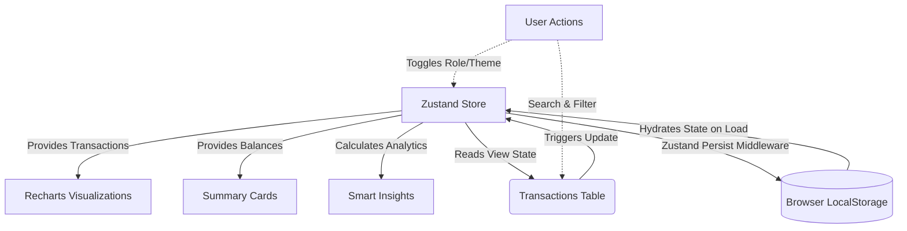

<div align="center">

<!-- Animated Header -->


<br/>

[](https://react.dev/)
[](https://vitejs.dev/)
[](https://tailwindcss.com/)
[](https://zustand-demo.pmnd.rs/)
[](https://finance-dashboard-ui-seven.vercel.app/)

<br/>

**🔗 Live Demo:** [finance-dashboard-ui-seven.vercel.app](https://finance-dashboard-ui-seven.vercel.app/)

<br/>

> *"Crafted for those who demand the finest."*

</div>

---

## 📖 Project Overview

The **Finance Dashboard UI** is a frontend-centric web application designed to help users track and manage their financial activity through a highly interactive, beautifully crafted modern interface. It handles localized data, live visual charting, complex tabular information, and robust role-based access logic—all seamlessly calculated without needing a backend.

---

## ✨ Key Features

| Feature | Description | Interaction |
| :--- | :--- | :--- |
| **📊 Dashboard Overview** | Adaptive tracking of Total Balance, Income, and Expenses. | *Auto-calculates on data entry* |
| **📈 Dynamic Visualizations** | Balance Trend (Line Chart) and Spending Breakdown (Pie Chart) powered by *Recharts*. | *Hover for contextual tooltips* |
| **📝 Transactions Manager** | Complete rich-data table. Supports **Adding, Editing, and Deleting** directly. | *Admin mode only* |
| **🔍 Real-time Filtering** | Instantly sort transactions by Search terms, Categories, or Income/Expense Types. | *Updates views & charts instantly* |
| **🔐 Role-Based UI** | Frontend RBAC simulation. Easily toggle between **Admin** and **Viewer** permissions. | *Header Dropdown Menu* |
| **💡 Smart Insights** | Fetches highest spending categories and custom observation metrics. | *Analyzed securely on-the-fly* |
| **💾 LocalStorage Persistence**| Utilizes **Zustand**'s `persist` API to cache changes locally across browser sessions. | *Automatic Data Hook* |
| **📥 Easy Exporting** | Download the current transaction view natively to `.csv` and `.json` formats. | *One-click table exports* |
| **🌓 Premium Theming** | Fluid Light & Dark modes backed by **Framer Motion** enter animations. | *Header Toggle Button* |

---

## 🏛️ System Architecture

The application is built completely on the frontend to showcase high-level component architecture and performant state management logic. 



### Data Flow Explained
1. **Zustand Central Store**: Acts as the single source of truth for all transactional data, UI theme preferences, and the current simulated Role.
2. **Component Subscribers**: The Dashboard Cards, Charts, and Insights subscribe to specific slices of the Zustand store and reactively auto-calculate values based on `useMemo` hooks to avoid expensive re-renders.
3. **Persist Middleware**: Before closing the application, data automatically syncs into `LocalStorage`. On opening the app, it effortlessly hydrates back to exactly where the user left off.

---

## 📂 Directory Structure

```text
📦 src
 ┣ 📂 components
 ┃ ┣ 📂 Dashboard
 ┃ ┃ ┣ 📜 BalanceChart.tsx     # Recharts continuous line data
 ┃ ┃ ┣ 📜 CategoryChart.tsx    # Recharts categorical pie data
 ┃ ┃ ┣ 📜 Insights.tsx         # Auto-calculated analytical cards
 ┃ ┃ ┣ 📜 SummaryCards.tsx     # Overview generic financial cards
 ┃ ┃ ┗ 📜 TransactionsTable.tsx # The powerhouse data grid w/ Modals
 ┃ ┣ 📂 ui
 ┃ ┃ ┗ 📜 Card.tsx             # Reusable UI primitives
 ┃ ┗ 📜 Navbar.tsx             # Controls theme & roles
 ┣ 📂 data
 ┃ ┗ 📜 mockData.ts            # Bootstrapped local application data
 ┣ 📂 store
 ┃ ┗ 📜 useStore.ts            # Zustand Core Logic & Type Interfaces
 ┣ 📂 utils
 ┃ ┗ 📜 cn.ts                  # Tailwind class merge utilities
 ┣ 📜 App.tsx                  # Main layout & Framer Motion logic
 ┣ 📜 index.css                # Global CSS variables for themes
 ┗ 📜 main.tsx                 # Core DOM injector
```

---

## 🚀 Setup Instructions

Follow these steps to run the application locally:

1. **Clone the repository:**
   ```bash
   git clone https://github.com/kinshukkush/Finance-Dashboard-UI.git
   cd "Finance Dashboard UI"
   ```

2. **Install Dependencies:**
   Ensure you have [Node.js](https://nodejs.org/) installed, then run:
   ```bash
   npm install
   ```

3. **Run the Development Server:**
   ```bash
   npm run dev
   ```
4. **View the Application:**
   Navigate to `http://localhost:5173` (or the specific port Vite opens) to view the incredibly aesthetic UI design.

---

## 👨‍💻 Developer

<div align="center">

### **Kinshuk Saxena**

Frontend Developer Intern | Full Stack Developer | React Native Enthusiast | Music Lover

[](https://github.com/kinshukkush)
[](https://www.linkedin.com/in/kinshuk-saxena-/)
[](https://portfolio-frontend-mu-snowy.vercel.app/)
[](mailto:kinshuksaxena3@gmail.com)
[](tel:+919057538521)

</div>

---

<div align="center">

**Made with ❤️ and 🎵 by Kinshuk Saxena**

⭐ Star this repo if you like it!

</div>
